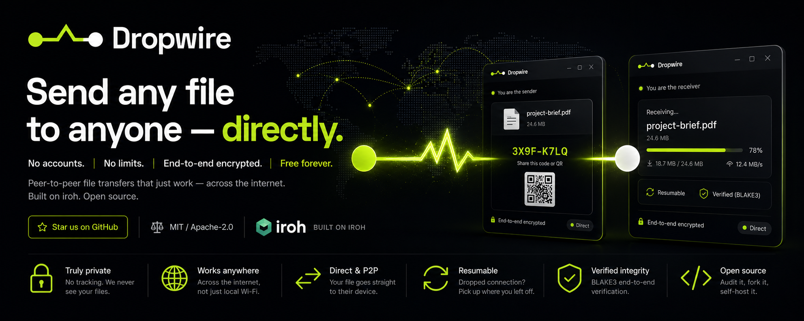

<div align="center">

<picture>
  <source media="(prefers-color-scheme: dark)" srcset="branding/wordmark-dark.svg" />
  
</picture>

<br /><br />



<br /><br />

A peer-to-peer file-transfer app built on [iroh](https://iroh.computer): no accounts,
no file-size limits, no server in the middle holding your data — end-to-end encrypted,
resumable, and open source.

<br />


[**Download**](https://github.com/muhamadjawdatsalemalakoum/dropwire/releases) ·
[Architecture](ARCHITECTURE.md) ·
[Privacy](docs/PRIVACY.md) ·
[Contributing](CONTRIBUTING.md)

</div>

---

> **Status:** early development (pre-alpha). The transfer engine and desktop app are
> being built now. See [`ARCHITECTURE.md`](ARCHITECTURE.md) for the design and
> [`docs/BUSINESS.md`](docs/BUSINESS.md) for the sustainability model.

## Why Dropwire

Most "easy" file-transfer tools make you pick a poison: LocalSend only works on the same
Wi-Fi; magic-wormhole and croc are command-line tools; Send Anywhere and WeTransfer route
your files through their servers with size caps and ads. Dropwire is the missing option:

- **Free forever.** No limits, no subscriptions, no ads.
- **Truly private.** End-to-end encrypted. No account, no sign-in, no tracking. We never
  see your files — and neither does anyone else.
- **Direct, peer-to-peer.** Your file goes straight from your device to theirs. When a
  direct connection isn't possible, it falls back to an encrypted relay that still can't
  read a single byte.
- **Works across the internet** — not just your local network.
- **Resumable.** A dropped connection picks up where it left off.
- **Open source.** Dual-licensed MIT / Apache-2.0. Audit it, fork it, self-host it.

## How it works

1. **Pick** a file or folder.
2. **Share** the short code (or QR) Dropwire gives you.
3. The other person enters the code and the transfer runs **directly, device to device.**

Under the hood: each device has a stable cryptographic identity (you "dial a key, not an
IP"); peers find each other via DNS/DHT discovery; the connection is QUIC with TLS 1.3;
content is verified end-to-end with BLAKE3 so resume and integrity come for free.

## Repository layout

```
core/          # `irohcore` — the transfer engine (the only crate that imports iroh/iroh-blobs)
src-tauri/     # desktop app shell (Tauri v2)            [added in M2]
www/           # static landing page
docs/          # BUSINESS.md and other docs
branding/      # brand identity + assets
infra/         # self-hosted relay + DNS server configs and deploy scripts  [M4]
ARCHITECTURE.md
```

## Building (developers)

Requires the [Rust toolchain](https://rustup.rs) and a C toolchain (see
[`docs/DEVELOPING.md`](docs/DEVELOPING.md) for per-OS prerequisites). No Node/JS build step — the
UI is plain HTML/CSS/JS.

```sh
cargo test -p irohcore        # engine tests (roundtrip + resume), hermetic/offline
cargo run  -p dropwire        # build + launch the desktop app
cargo tauri build             # build installers (needs `cargo install tauri-cli`)
```

Full developer guide: [`docs/DEVELOPING.md`](docs/DEVELOPING.md). Design: [`ARCHITECTURE.md`](ARCHITECTURE.md).

## Privacy

Dropwire collects nothing. There are no accounts, no analytics, and no phone-home. Your
node identity and transfer history live only on your machine. The only network services
involved are discovery and the relay fallback — and the relay only ever forwards encrypted
packets it cannot decrypt. See [`docs/PRIVACY.md`](docs/PRIVACY.md) (coming with M5).

## License

Dual-licensed under either of

- Apache License, Version 2.0 ([LICENSE-APACHE](LICENSE-APACHE))
- MIT license ([LICENSE-MIT](LICENSE-MIT))

at your option. Built with [iroh](https://iroh.computer) by [n0](https://n0.computer).
