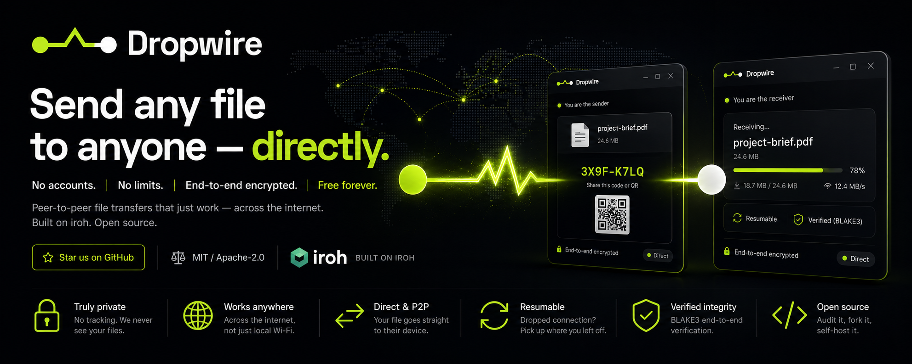
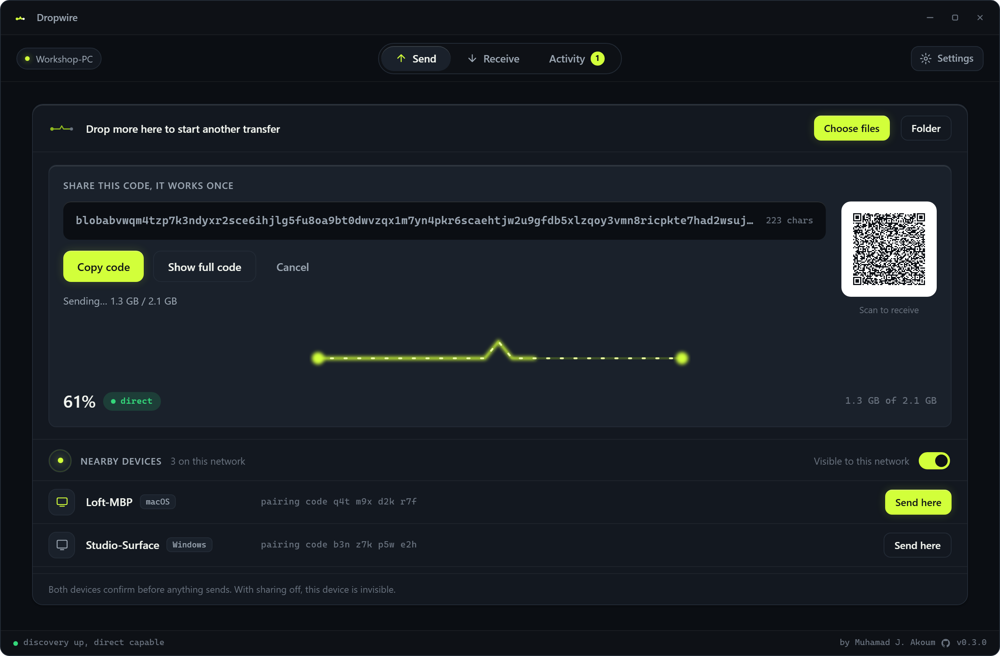
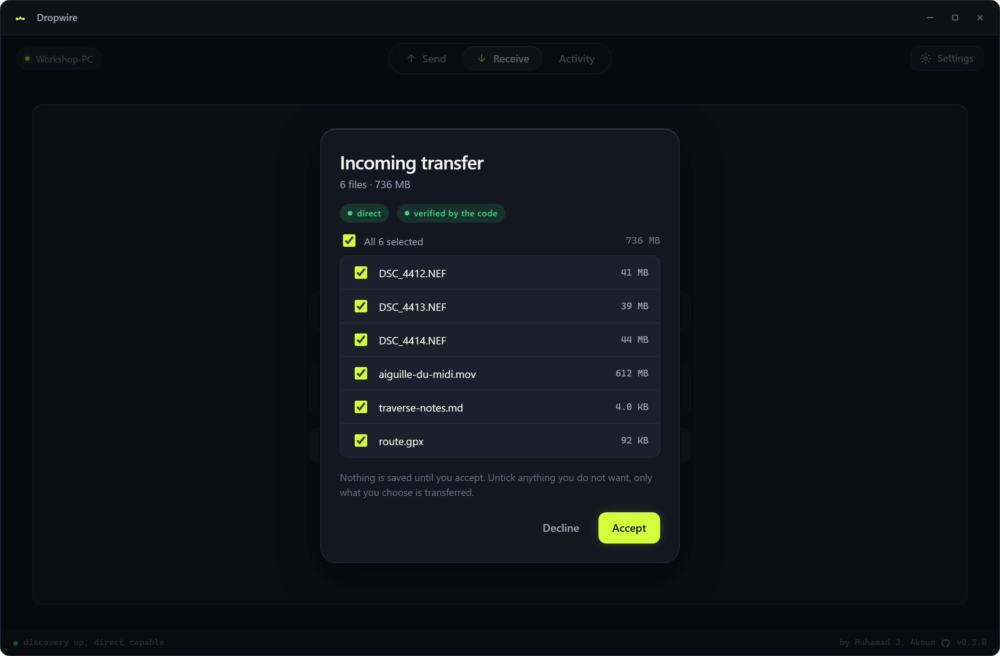
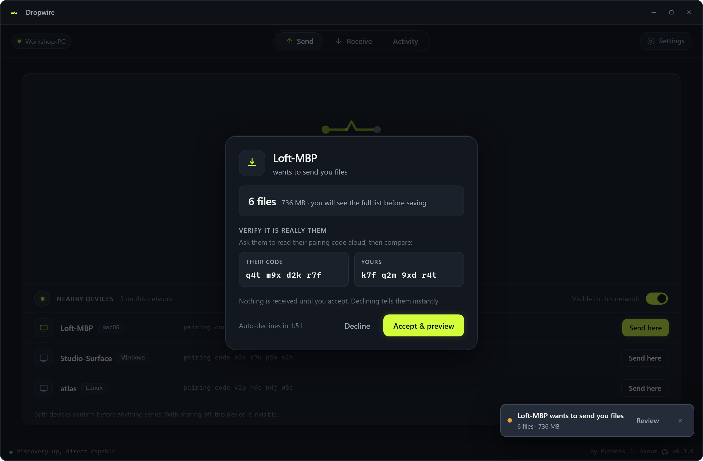
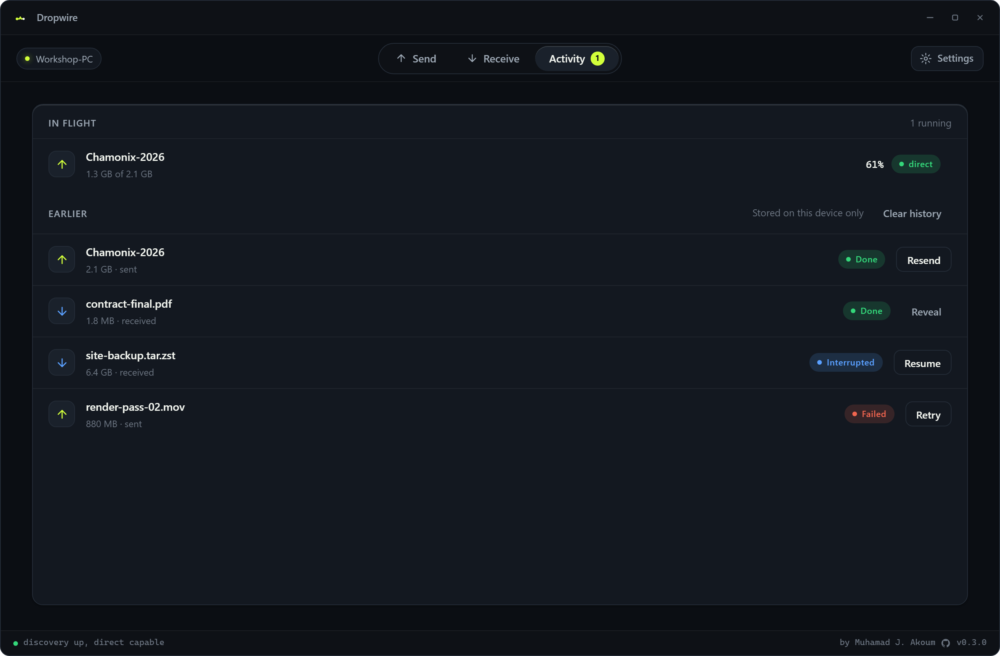
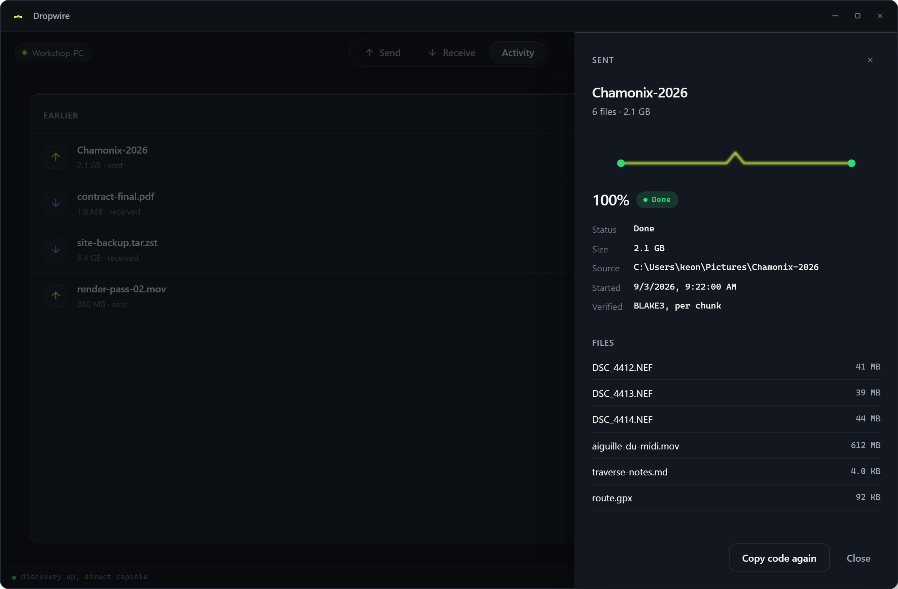
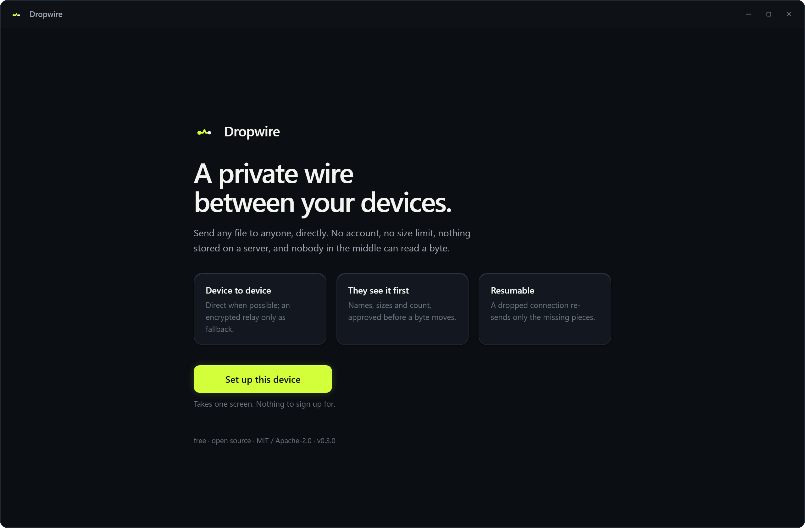
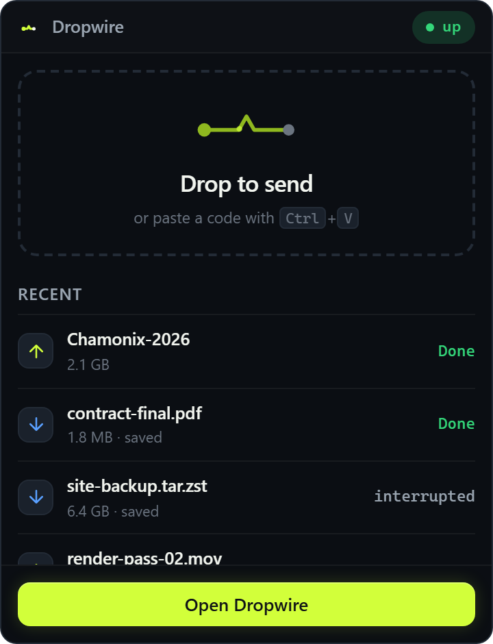
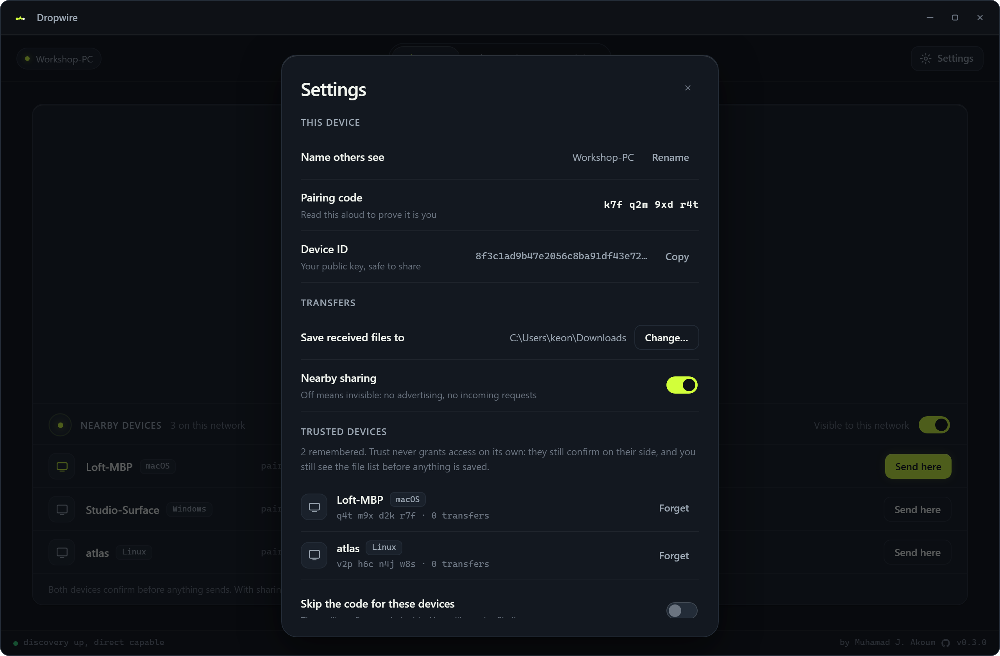
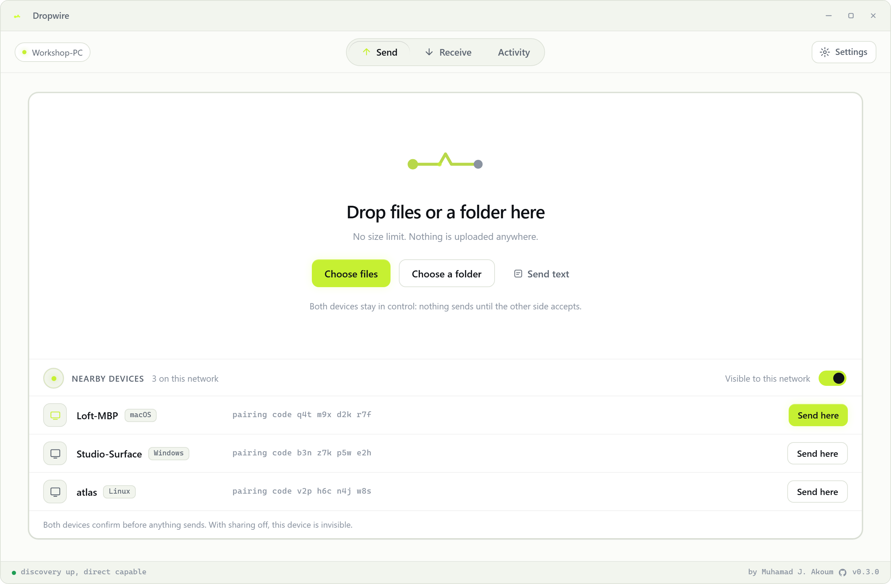

<div align="center">

<picture>
  <source media="(prefers-color-scheme: dark)" srcset="branding/wordmark-dark.svg" />
  
</picture>

<br /><br />



<br /><br />

A peer-to-peer file-transfer app built on [iroh](https://iroh.computer): no accounts,
no file-size limits, no server in the middle holding your data — end-to-end encrypted,
resumable, and open source.

<br />


[**Download**](https://github.com/muhamadjawdatsalemalakoum/dropwire/releases) ·
[Architecture](ARCHITECTURE.md) ·
[Privacy](docs/PRIVACY.md) ·
[Contributing](CONTRIBUTING.md)

</div>

---

> **Status:** beta. The transfer engine and desktop app work end to end on Windows,
> macOS, and Linux: send a file or folder, send straight to a nearby device with no code,
> preview before accepting, download only the files you want, resume an interrupted
> transfer, and run several at once. The interface was rebuilt in 0.3.0 as a fixed native
> frame rather than a page in a window. See [`ARCHITECTURE.md`](ARCHITECTURE.md) for the
> design and [`CHANGELOG.md`](CHANGELOG.md) for what landed when.

## Why Dropwire

Most "easy" file-transfer tools make you pick a poison: LocalSend only works on the same
Wi-Fi; magic-wormhole and croc are command-line tools; Send Anywhere and WeTransfer route
your files through their servers with size caps and ads. Dropwire is the missing option:

- **Free forever.** No limits, no subscriptions, no ads.
- **Truly private.** End-to-end encrypted. No account, no sign-in, no tracking. We never
  see your files — and neither does anyone else.
- **See it before you accept.** The receiver previews exactly what's coming — file names, sizes,
  and count — and approves before a single byte downloads. Both sides see, live, when the other
  device connects.
- **Nearby devices, no code needed.** Dropwire apps on the same network find each other
  automatically and appear as one-tap targets. Tap a device, they confirm, and it sends.
  Both sides confirm every transfer, and each side shows a pairing code you can read aloud
  to check you're talking to the right device. Turn nearby sharing off and your device is
  invisible: it stops advertising and refuses incoming requests.
- **Direct, peer-to-peer.** Your file goes straight from your device to theirs. When a
  direct connection isn't possible, it falls back to an encrypted relay that still can't
  read a single byte.
- **Works across the internet** — not just your local network.
- **Resumable.** A dropped connection picks up where it left off — only the missing
  pieces are re-sent, verified end to end as they arrive.
- **Take only what you want.** Receiving a folder? Untick the files you don't need —
  only what you choose is transferred.
- **One code, one recipient.** A code isn't a public link: it's served to the first
  device that connects, and others are refused.
- **Several at once.** Run multiple sends and receives in parallel, each with its own
  live progress and a direct-vs-relayed badge.
- **A desktop app, not a web page in a window.** One fixed frame that draws its own title
  bar on all three platforms. Nothing scrolls out of view, nothing needs resizing, and one
  thing is on screen at a time.
- **Stays out of the way.** It lives in the tray, so closing the window keeps you reachable
  by the people you are already talking to. Devices you have transferred with are
  remembered, and can optionally skip the consent step. Trust never grants access on its
  own: they still confirm on their side, and you still see the file list first.
- **Open source.** Dual-licensed MIT / Apache-2.0. Audit it, fork it, self-host it.

## How it works

1. **Pick** a file or folder.
2. **Share** the one-time transfer code or QR Dropwire gives you — copy it into any chat,
   or have them scan the QR.
3. The other person enters the code, **previews exactly what's being sent — names, sizes,
   and count — and accepts** (or declines, and you're told instantly). Then it runs
   **directly, device to device**, with a live direct-vs-relayed badge.

On the same network, you can skip the code entirely: the other device shows up under
**Nearby devices**, you tap **Send here**, and they get a confirm dialog. Nothing moves
until both sides agree, and the receiver still previews the real file list before saving.

Under the hood: each device has a stable cryptographic identity (you "dial a key, not an
IP"); peers find each other via DNS/DHT discovery; the connection is QUIC with TLS 1.3;
content is verified end-to-end with BLAKE3 so resume and integrity come for free.

## In the app

One fixed window with its own chrome on Windows, macOS, and Linux. Nothing scrolls out of
view and nothing needs resizing. These are captures of the shipped interface at its real
size, with sample transfers in it.

### Send



Drop a file or a folder and you get a one-time code and a matching QR. The code is a field
you copy, with the full value one click away, rather than a wall of characters that pushes
the rest of the screen out of view. Once a transfer starts the picker collapses to a bar so
the transfer is the subject of the screen. Devices on the same network sit underneath, one
tap away, with their platform next to the hostname so two similarly named machines are easy
to tell apart.

### Receive



Paste the code and you see the real file list before anything is written: names, sizes, and
count, committed by the transfer code so the sender cannot fake them. Untick what you do not
want. Nothing is saved until you accept.

### Nearby devices



On the same network you can skip the code entirely. Both sides confirm, and each shows a
pairing code you read aloud to check you are talking to the right machine. Turn sharing off
and the device stops advertising and refuses incoming requests.

### Activity



Everything in flight and everything earlier, in one place, with a live count on the tab.
An interrupted receive offers Resume, a send that never got through offers Retry.



Any row opens a detail view: the peer, the pairing code, the route, when it started, the
per-file breakdown, and the verified file list.

### First run



Two screens: what Dropwire is, then name this device and choose whether to be visible.
Nothing touches the network until you finish.

### Tray



A tray icon that reports state at a glance, and a small panel to see what is running, drop
something new, or paste a code. Closing the window keeps Dropwire running so nearby devices
can still reach you.

### Settings, and a light theme






## Repository layout

```
core/          # `irohcore` — the transfer engine (the only crate that imports iroh/iroh-blobs)
src-tauri/     # desktop app shell (Tauri v2)
ui/            # the desktop app's frontend (plain HTML/CSS/JS — no build step)
www/           # static landing page
docs/          # PRIVACY.md, DEVELOPING.md, and other docs
branding/      # brand assets (logo, wordmark, icons)
infra/         # self-hosted relay + DNS server configs and deploy scripts
ARCHITECTURE.md
```

## Building (developers)

Requires the [Rust toolchain](https://rustup.rs) and a C toolchain (see
[`docs/DEVELOPING.md`](docs/DEVELOPING.md) for per-OS prerequisites). No Node/JS build step — the
UI is plain HTML/CSS/JS.

```sh
cargo test -p irohcore --features test-utils   # engine tests, hermetic/offline
cargo run  -p dropwire                         # build + launch the desktop app
cargo tauri build                              # build installers (needs `cargo install tauri-cli`)
```

`--features test-utils` matters: the nearby-consent and relay suites declare it as a
required feature, so plain `cargo test` compiles them out and reports success without
having run them. The live-multicast discovery test is additionally `#[ignore]`d; run it
on a real network with:

```sh
cargo test -p irohcore --features test-utils --test nearby_mdns -- --ignored --nocapture
```

Two instances on one machine need separate data dirs: `cargo run -p dropwire -- --data-dir=/tmp/dw-b`.

Full developer guide: [`docs/DEVELOPING.md`](docs/DEVELOPING.md). Design: [`ARCHITECTURE.md`](ARCHITECTURE.md).

## Privacy

Dropwire collects nothing. There are no accounts, no analytics, and no phone-home. Your
node identity and transfer history live only on your machine. The only network services
involved are discovery and the relay fallback — and the relay only ever forwards encrypted
packets it cannot decrypt. See [`docs/PRIVACY.md`](docs/PRIVACY.md).

## License

Dual-licensed under either of

- Apache License, Version 2.0 ([LICENSE-APACHE](LICENSE-APACHE))
- MIT license ([LICENSE-MIT](LICENSE-MIT))

at your option. Built with [iroh](https://iroh.computer) by [n0](https://n0.computer).
